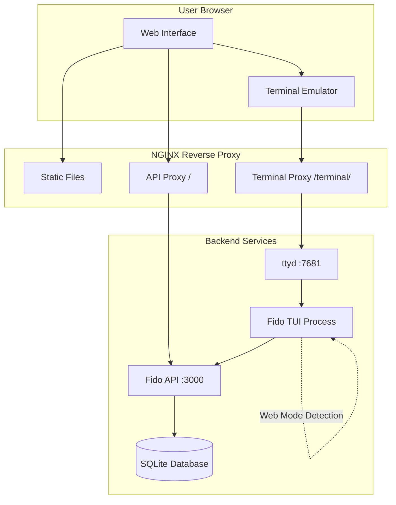

# Web Terminal Interface Design

## Overview

The web terminal interface enables users to interact with Fido through a browser-based terminal emulator while maintaining the native terminal experience. The system leverages ttyd (terminal-to-web) technology with NGINX as a reverse proxy to host the Fido TUI in a web environment. The design supports both authenticated GitHub users accessing real data and isolated test users for demonstration purposes.

## Architecture



### Component Interaction Flow

1. **Web Interface Loading**: User visits the web interface, NGINX serves static HTML/CSS/JS
2. **Terminal Initialization**: JavaScript loads ttyd terminal emulator in iframe
3. **Mode Detection**: Fido TUI detects web mode via `FIDO_WEB_MODE` environment variable
4. **Authentication Flow**: Users can authenticate with GitHub, credentials stored in browser storage
5. **Data Isolation**: Test users operate in isolated data space, real users access production data

### Web Interface Components

#### NGINX Configuration
- **Port**: 8080 (external web interface)
- **Static File Serving**: Serves HTML, CSS, JS from `/var/www/html`
- **Terminal Proxy**: Routes `/terminal/` to ttyd on port 7681
- **API Proxy**: Routes all other requests to Fido API on port 3000
- **No Path Rewriting**: Maintains original API routes without `/api` prefix

#### ttyd Terminal Service
- **Port**: 7681 (internal WebSocket connection)
- **Process**: Spawns Fido TUI with `FIDO_WEB_MODE=true`
- **Theme**: Dark terminal theme with modern aesthetics
- **Font**: Monospace font optimized for terminal display

#### Fido API Server
- **Port**: 3000 (internal API service)
- **Routes**: Existing routes without `/api` prefix (e.g., `/posts`, `/auth/login`)
- **Mode Detection**: Responds to web mode clients appropriately

## Components and Interfaces

### Web Mode Detection System

```rust
pub struct ModeDetector {
    is_web_mode: bool,
}

impl ModeDetector {
    pub fn new() -> Self {
        Self {
            is_web_mode: std::env::var("FIDO_WEB_MODE").is_ok(),
        }
    }
    
    pub fn is_web_mode(&self) -> bool {
        self.is_web_mode
    }
}
```

### Storage Adapter Interface

```rust
pub trait StorageAdapter {
    fn store_credentials(&self, credentials: &AuthCredentials) -> Result<()>;
    fn load_credentials(&self) -> Result<Option<AuthCredentials>>;
    fn clear_credentials(&self) -> Result<()>;
}

pub struct FileStorageAdapter {
    config_path: PathBuf,
}

pub struct BrowserStorageAdapter {
    // Uses browser APIs via JavaScript bridge
}
```

### Test User Isolation System

```rust
pub struct UserContext {
    pub user_type: UserType,
    pub isolation_key: Option<String>,
}

pub enum UserType {
    RealUser(String), // GitHub user ID
    TestUser(String), // Test user identifier
}

pub trait DatabaseAdapter {
    fn with_context(&self, context: &UserContext) -> Box<dyn DatabaseOperations>;
}
```

## Data Models

### Enhanced User Model

```rust
#[derive(Debug, Clone, Serialize, Deserialize)]
pub struct User {
    pub id: String,
    pub github_id: Option<String>,
    pub username: String,
    pub user_type: UserType,
    pub created_at: DateTime<Utc>,
    pub is_test_user: bool,
}
```

### Session Management

```rust
#[derive(Debug, Clone, Serialize, Deserialize)]
pub struct WebSession {
    pub session_id: String,
    pub user_id: String,
    pub user_type: UserType,
    pub created_at: DateTime<Utc>,
    pub expires_at: DateTime<Utc>,
    pub isolation_key: Option<String>,
}
```

### Test User Data Isolation

```rust
#[derive(Debug, Clone)]
pub struct IsolatedData {
    pub posts: Vec<Post>,
    pub messages: Vec<DirectMessage>,
    pub votes: Vec<Vote>,
    pub follows: Vec<Follow>,
}
```

## Correctness Properties

*A property is a characteristic or behavior that should hold true across all valid executions of a system-essentially, a formal statement about what the system should do. Properties serve as the bridge between human-readable specifications and machine-verifiable correctness guarantees.*

### Property 1: Keyboard Shortcut Consistency
*For any* keyboard input sequence, the web terminal should produce the same navigation and command results as the native TUI application.
**Validates: Requirements 1.2**

### Property 2: Authentication Storage Mode Selection
*For any* authentication attempt in web mode, credentials should be stored in browser storage, and for any authentication in native mode, credentials should be stored in local file storage.
**Validates: Requirements 2.1, 2.5**

### Property 3: Authenticated User Data Access
*For any* successfully authenticated user, the system should provide access to their complete set of posts, messages, and configuration data.
**Validates: Requirements 2.2**

### Property 4: Session Cleanup on Logout
*For any* user logout action, all session storage should be immediately cleared and the system should return to an unauthenticated state.
**Validates: Requirements 2.3, 2.4**

### Property 5: Test User Data Isolation
*For any* test user action (post creation, voting, messaging), the resulting data should never appear in production user queries or feeds.
**Validates: Requirements 3.1, 3.3, 3.4**

### Property 6: Test User Data Reset on Load
*For any* web interface load event, all existing test user data should be completely reset to a clean initial state.
**Validates: Requirements 3.2**

### Property 7: Mode Detection Accuracy
*For any* application startup, the system should correctly detect web mode when `FIDO_WEB_MODE` environment variable is present and native mode otherwise.
**Validates: Requirements 4.1**

### Property 8: Cross-Mode Functional Consistency
*For any* core application operation (posting, messaging, voting), the functionality should work identically in both web and native modes.
**Validates: Requirements 4.2, 4.3**

### Property 9: Mode-Specific Configuration Handling
*For any* configuration setting that differs between modes, the system should transparently apply the correct mode-specific value without affecting other settings.
**Validates: Requirements 4.5**

### Property 10: API Route Prefix Absence
*For any* API route definition in the server, the route path should not contain an "/api" prefix.
**Validates: Requirements 5.4**

### Property 11: Nginx Path Preservation
*For any* API request routed through nginx, the request path should reach the Fido API server without modification.
**Validates: Requirements 5.5**

### Property 12: ANSI Color Code Support
*For any* terminal output containing ANSI color codes, the web terminal should render the colors correctly according to standard ANSI specifications.
**Validates: Requirements 7.5**

## Error Handling

### Web Mode Failures
- **Storage Adapter Fallback**: If browser storage fails, gracefully degrade to memory-only storage
- **API Connection Issues**: Provide clear error messages for network connectivity problems
- **Terminal Connection Loss**: Automatic reconnection attempts with user notification

### Test User Isolation Failures
- **Data Leak Prevention**: Fail-safe mechanisms to prevent test data from appearing in production
- **Reset Operation Failures**: Comprehensive logging and retry mechanisms for data cleanup
- **Isolation Key Conflicts**: Unique key generation with collision detection

### Authentication Errors
- **GitHub OAuth Failures**: Clear error messages and retry mechanisms
- **Session Expiration**: Graceful handling with re-authentication prompts
- **Credential Storage Failures**: Fallback to session-only authentication

## Testing Strategy

### Unit Testing Approach
- **Mode Detection**: Test environment variable detection and storage adapter selection
- **Storage Adapters**: Test file-based and browser-based storage implementations
- **Data Isolation**: Test test user data separation and cleanup mechanisms
- **Port Configuration**: Test service startup with correct port assignments

### Property-Based Testing Approach
Using **proptest** for Rust property-based testing with minimum 100 iterations per test:

- **Web Mode Consistency**: Generate random application states and verify consistent storage behavior
- **Data Isolation**: Generate random user actions and verify test user data never leaks to production
- **Authentication Persistence**: Generate random session scenarios and verify credential handling
- **API Route Integrity**: Generate random API requests and verify path preservation through nginx
- **Port Configuration**: Generate random deployment scenarios and verify port assignments
- **Data Reset Completeness**: Generate random test user data and verify complete cleanup

### Integration Testing
- **Full Stack Testing**: End-to-end tests covering web interface → terminal → API → database
- **Multi-User Scenarios**: Test concurrent real and test user sessions
- **Service Coordination**: Test nginx, ttyd, and API server interaction
- **Browser Compatibility**: Test across different browsers and terminal emulators

### Performance Testing
- **Terminal Responsiveness**: Measure input lag and rendering performance
- **Concurrent Sessions**: Test multiple simultaneous web terminal sessions
- **Data Isolation Overhead**: Measure performance impact of test user separation
- **Memory Usage**: Monitor resource consumption during extended sessions

## Implementation Notes

### Deployment Configuration
- **Docker Multi-Stage Build**: Separate build and runtime stages for optimal image size
- **Service Orchestration**: Coordinated startup sequence (API → ttyd → nginx)
- **Health Checks**: Proper health check endpoints for all services
- **Log Aggregation**: Centralized logging for debugging and monitoring

### Security Considerations
- **Test User Sandboxing**: Strict isolation to prevent data contamination
- **Session Security**: Secure session token generation and validation
- **CORS Configuration**: Proper cross-origin resource sharing for web terminal
- **Input Sanitization**: Protection against terminal injection attacks

### Scalability Considerations
- **Session Management**: Efficient session storage and cleanup
- **Database Partitioning**: Logical separation of test and production data
- **Resource Limits**: Per-session resource constraints for test users
- **Cleanup Automation**: Automated test data cleanup and maintenance