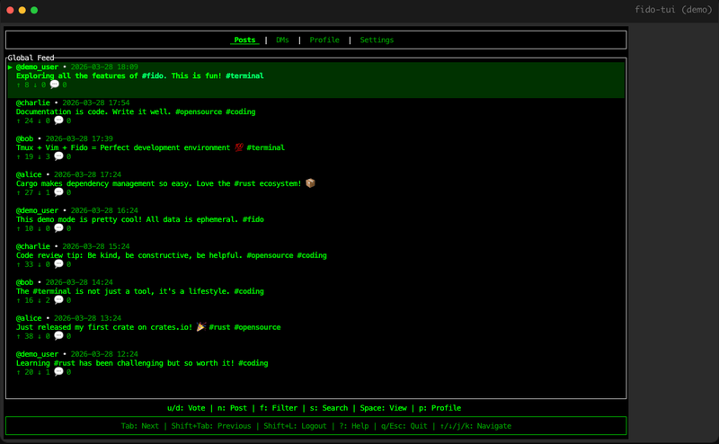

# Fido

Fido is a terminal community app for GitHub repositories.

Run it inside a repo and Fido opens that repo's community board. Run it outside a repo and Fido shows the communities you have joined. Posts, replies, channels, DMs, and notifications stay tied to the GitHub projects people are already working in.



## Badge

Show your repo's fido community in the README:

````markdown
[](https://github.com/OWNER/REPO)
````

The badge is live — it always shows the current member count.

## Live Demo

Production demo: https://fido-web-production.up.railway.app/

## Install

First, make sure you have [Rust](https://rustup.rs/) installed.

```bash
cargo install fido
```

Or build from source:

```bash
git clone https://github.com/ianjamesburke/fido.git
cd fido
cargo build --release
```

## Quick Start

Open a GitHub-backed project and launch Fido:

```bash
cd path/to/your/repo
fido
```

Fido reads the repo's GitHub `origin`, joins that repository's community, and opens its board.

You can also launch it anywhere:

```bash
fido
```

Outside a GitHub repo, Fido opens Home mode with your joined communities.

Login with GitHub or pick a test user for a quick demo. Press `?` for help, `Tab` to switch tabs, `n` to post, and `q` to quit. Your session saves to `~/.fido/session`.

See [QUICKSTART.md](QUICKSTART.md) for the longer walkthrough.

## What You Can Do

- Open the community for the GitHub repo in your current directory
- Browse joined repo communities from Home mode
- Post threads and replies scoped to a repo community
- Use channels for community chat
- DM other developers
- Claim community admin when you have GitHub admin or maintain access on the repo
- Use keyboard-first navigation throughout the TUI

## Key Controls

- `Tab` - Switch tabs
- `j/k` or arrows - Navigate
- `Enter` - Open the selected community from Home mode
- `b` - Browse starred GitHub repositories
- `v` - Open notifications
- `i` - Open community settings
- `a` - Open approval queue as a community admin
- `o` - Open the selected GitHub issue or PR in a browser
- `u/d` - Upvote or downvote
- `n` - New post
- `p` - View profile
- `s` - Search users
- `?` - Help
- `q` - Quit

## Local Development

The project uses a Rust workspace:

- `fido-types` - shared models and API types
- `fido-server` - Axum API server with SQLite
- `fido-tui` - Ratatui terminal client, published as `fido`

Run the server:

```bash
just server
```

Run the TUI against the local server:

```bash
just tui-local
```

Or use Cargo directly:

```bash
cargo run --bin fido-server
cargo run --bin fido -- --server http://127.0.0.1:4747
```

Required server environment:

- `GITHUB_CLIENT_ID` - GitHub OAuth app client ID
- `FIDO_TOKEN_KEY` - encryption key for stored GitHub tokens

Useful optional environment:

- `DATABASE_PATH` - SQLite database file path
- `FIDO_SERVER_URL` - default server URL for the TUI
- `ALLOWED_ORIGINS` - CORS allowlist for deployed web clients
- `RUST_LOG` - server logging level

## Web Terminal Demo

Run the browser-based terminal stack:

```bash
./start.sh
```

This starts:

- `fido-server` on port 4747
- `ttyd` on port 7681
- `nginx` on port 8080

Open http://localhost:8080.

## Tests

```bash
cargo fmt --check
cargo test --workspace
cargo clippy --workspace --all-targets --all-features -- -D warnings
```

The TUI end-to-end harness drives the real binary in tmux with a temporary server and a stubbed GitHub API:

```bash
just e2e-tui
```

## Deploy

Fido deploys on Railway from `main`. The web deployment runs nginx, ttyd, the TUI, and the API server. SQLite lives on a persistent Railway volume.

Manual deploy:

```bash
railway up
```

Crates release preflight:

```bash
just prerelease-check
```

`just deploy-cargo-dry` runs the same publish preflight without publishing. It fails on a dirty worktree unless `FIDO_ALLOW_DIRTY_PUBLISH=1` is set, checks exact `fido-types@<version>` and `fido@<version>` registry state, and refuses to report success if the `fido` publish dry-run was skipped. `just deploy-cargo` publishes `fido-types` first, waits for crates.io indexing, then publishes `fido`. `fido-server` is deployed infrastructure and is not published to crates.io.

Required Railway variables:

- `GITHUB_CLIENT_ID`
- `FIDO_TOKEN_KEY`
- `RUST_LOG`

## License

MIT
